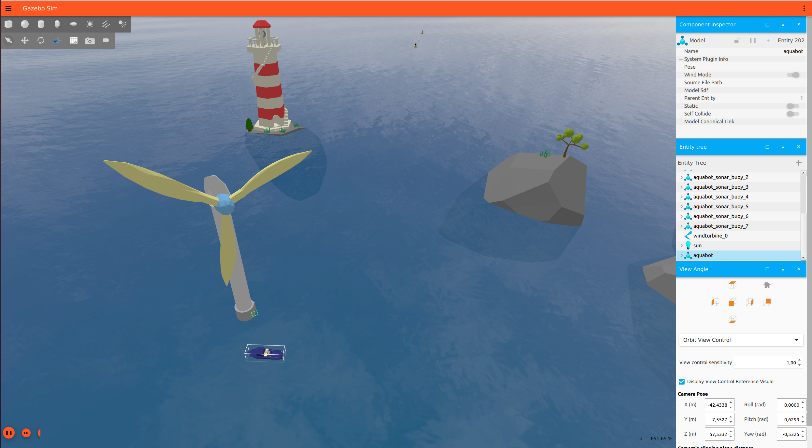

# keikoBot

A compact ROS 2 package used in the Aquabot (VRX) simulation. It contains a launch file to start the simulation and small helper nodes used for our competition setup.

## Quick Start

1. Clone `keikoBot` into your `Aquabot-Competitor` workspace.
2. Source ROS 2 and your workspace, build, then launch the simulation. Example commands we used:

```bash
source /opt/ros/humble/setup.bash
source ~/vrx_ws/install/setup.bash
cd ~/vrx_ws
colcon build --merge-install
ros2 launch ./src/Aquabot-Competitor/keikoBot/launch/aquabot.launch.py
```

## Choosing a world/map

- To pick a different world, change the `world` argument in the launch file (line ~29) or pass a different value when launching.

## Contents Overview

- `launch/` — `aquabot.launch.py` to start the simulation and nodes.
- `boat_mover/` — node for moving the boat in simulation.
- `qr_code_V2_pkg/` — QR detection and reading utilities.
- `media/` — media assets for docs or presentation.

## Simulation screenshot


